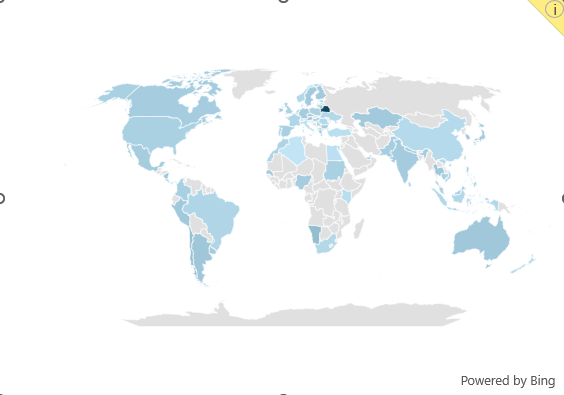

# Proyecto en EXCEL sobre los Salarios de los Trabajadores en el rubro de la ciencia de datos.
Este proyecto fue realizado con la ayuda y guia de @LukeBarousse.

# Excel Dashboard Salarios


## Introduccion

Este proyecto tiene la finalidad de ayudar a los trabajadores dentro de la ciencia de datos a conocer cuales son los salarios promedios segun paises, o rubro
dentro de la profesion.
Los datos utilizados en el proyecto fueron obtenidos para utilizar como ejemplos del curso de Excel de @LukeBarousse. Nos permite trabajar con ésta herramienta
esencial en el analisis de datos. Los "woorkbook" utilizados en el proyecto tienen informacion sobre: "job titles" (trabajos), "salaries" (salarios), "locations"
(locaciones), "essential skills" (habilidades y conocimientos).

### Dashboard
El proyecto final se encuentra en: [1_Salary_Dashboard.xlsx](1_Salary_Dashboard.xlsx).

### Habilidades en Excel utilizadas:

- **📉 Graficos**
- **🧮 Formulas y Funciones**
- **❎ Validacion de datos**

### Dataset 
La Dataset de este proyecto contiene datos reales sobre trabajos relacionados con la ciencia de datos durante el 2023

- **👨‍💼 Job titles (Trabajos)**
- **💰 Salaries (Salarios)**
- **📍 Locations (Locaciones)**
- **🛠️ Skills (Habilidades y conocimientos)**

## Creacion de Gráficos

### 📉 Graficos

#### 📊 Salarios de trabajos en Ceincia de datos - Grafico de barras


- 🛠️ **Excel:** Se utilizó la función de gráfico de barras (con valores salariales formateados) y diseño optimizado para mayor claridad.
- 🎨 **Elección de diseño:** Gráfico de barras horizontales para comparación visual de salarios medios.
- 📉 **Organización de datos:** Títulos de trabajo ordenados por salario descendente para mejorar la legibilidad.
- 💡 **Información obtenida:** Esto permite una rápida identificación de las tendencias salariales, teniendo en cuenta que los puestos sénior
-                               y los ingenieros pagan más que los puestos de analista.

#### 🗺️ Salarios medios por país - Gráfico de mapa



- 🛠️ **Excel:** Se utilizó la función de gráfico de mapas de Excel para trazar los salarios medios a nivel mundial.
- 🎨 **Elección de diseño:** Mapa codificado por colores para diferenciar visualmente los niveles salariales en las distintas regiones.
- 📊 **Representación de datos:** Salario medio graficado para cada país con datos disponibles.
- 👁️ **Mejora visual:** Legibilidad mejorada y comprensión inmediata de las tendencias salariales geográficas.
- 💡 **Información obtenida:** Permite comprender rápidamente las disparidades salariales globales y destaca las regiones con salarios altos y bajos.

### 🧮 Formulas y Funciones

#### 💰 Salario Medio por Trabajo

```
=MEDIAN(
IF(
    (jobs[job_title_short]=A2)*
    (jobs[job_country]=country)*
    (ISNUMBER(SEARCH(type,jobs[job_schedule_type])))*
    (jobs[salary_year_avg]<>0),
    jobs[salary_year_avg]
)
)
```

- 🔍 **Filtrado de múltiples criterios:** verifica el Trabajo, el país, el tipo de horario laboral y excluye la informacion Faltante (N/A, y espacios en blanco).
- 📊 **Array Formula:** Utilizamos la funcion `MEDIAN()` con otra funcion `IF()` anidada para analizar el arreglo.
- 🎯 **Información personalizada:** Proporciona información salarial específica para puestos de trabajo, regiones y tipos de horarios.
- 🔢 **Propósito de la fórmula:** Esta fórmula completa la tabla a continuación y devuelve el salario medio según el puesto de trabajo, el país y el tipo especificado.

🍽️ Background Table (Tabla utilizada como base)


📉 Implementación del Dashboard


#### ⏰ Recuento de tipos de horarios laborales

```
=FILTER(J2#,(NOT(ISNUMBER(SEARCH("and",J2#))+ISNUMBER(SEARCH(",",J2#))))*(J2#<>0))
```

- 🔍**Generación de lista única:** la siguiente fórmula de Excel emplea la función `FILTER()` para excluir entradas que contengan "y" o comas y omitir valores cero.
- **🔢 Propósito de la fórmula:** Esta fórmula completa la tabla a continuación, lo que nos brinda una lista de tipos de horarios laborales únicos.

🍽️ Background Table (Tabla utilizada como base)


📉 Implementación del DashBoard:


### ❎ Validación de datos

#### 🔍 Lista filtrada

- 🔒 **Validación de datos mejorada:** La implementación de la lista filtrada como una regla de validación de datos en las opciones "Trabajo", "País" y "Tipo" en la 
                                        pestaña Datos garantiza lo siguiente:
    - 🎯 La entrada del usuario está restringida a tipos de programación predefinidos y validados
    - 🚫 Se evitan entradas incorrectas o inconsistentes
    - 👥 Se ha mejorado la usabilidad general del panel de control


## Conclusion

Creé este panel para mostrar información sobre las tendencias salariales en diversos puestos de trabajo relacionados con la ciencia de datos. Utilizando datos del curso de Excel, este DashBoard permite a los usuarios tomar decisiones informadas sobre sus trayectorias profesionales. Explora las funcionalidades para comprender cómo la ubicación y el tipo de puesto influyen en los salarios.

## Trabajo realizado por Lucas Eloy Fernandez, Analista de Datos Jr. 
